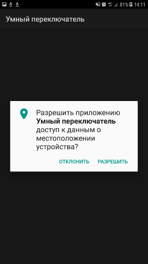

## What is SmartSwitcher?

Smart Switcher - application that have main goal to enable
and disable WiFi and Bluetooth interfaces automatically. Firstly,
it has options to disable WiFi, Bluetooth interfaces on ilde more
that N minutes. Secondly, the SmartSwitcher can enable interfaces
to check if know WiFi network or Bluetooth device is near.

## Why location permission needed?
According to Google documentation, coarse location needed to bluetooth
scan. If you don't give this permission to SmartSwitcher, the bluetooth
receiver of application will not receive bluetooth scan event.
You can check sources to be sure that application is not gather your
location and don't use it.

## Tested on devices

* Samsung A7 2017
* Samsung J3

## What framework is used in project?
https://github.com/Zeddushka/Android-Architecture-Framework

## Known issues

* Do not set Bluetooth known scan to low values. Bluetooth scan has very high power consumption. In future, I will check how it will be on BT LE Scan

## TODO
* Tests
* Make settings entering transparent
* Make some graphical smmoth and pretty information about current statuses on logon (like wifi idleing or e.t.c.)
* Make scheduled anebling of wifi (like: enable WiFi on 10 minutes every work day at 18:00 and disableing it every work day at 7:00 - when you are away from your home's WiFi; enable bluetooth at 17:00 when you've just sit in your car for connecting to car's devices)
* Check in DOZE

## Screenshots

